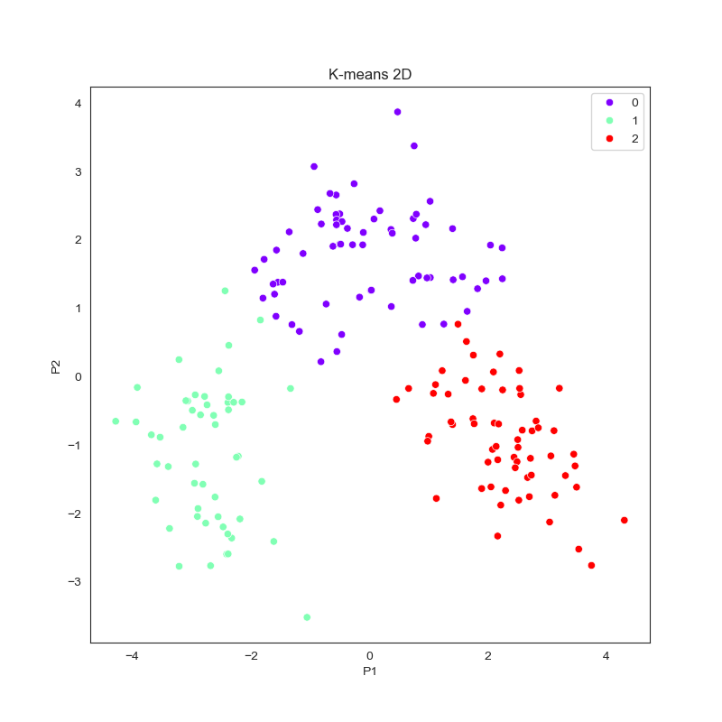

## Mateusz Dzięgielewski
I am third-year student at Wrocław University of Business and Economics, Poland and I pursue career in data science. I am extremely passionate about analyzing data, investigating it and making predictions out of it.
### This is my data science portfolio - you can see the overview of my GitHub projects here.
*To see more details click on project's title.*

# [Project 1: Analysis of the 2020-2024 Premier League Seasons (python)](https://github.com/mateuszdziegielewski/premier_league)
The purpose of this project is to analyze the last 5 seasons of the English Premier League. The analysis consists of two parts:
* Comparing different teams' and formations' performances, including  visualisations and the expected points table for each season
* Machine learning model designed to predict match results based on game statistics

")

# [Project 2: Clustering wine based on it's chemical characteristics (python)](https://github.com/mateuszdziegielewski/wine_clustering)
The analysis uses unsupervised machine learning algorythms to classify wines coming from different wineries into groups - each winery as one cluster. The only given varaibles are chemical qualities of every wine from the dataset.

